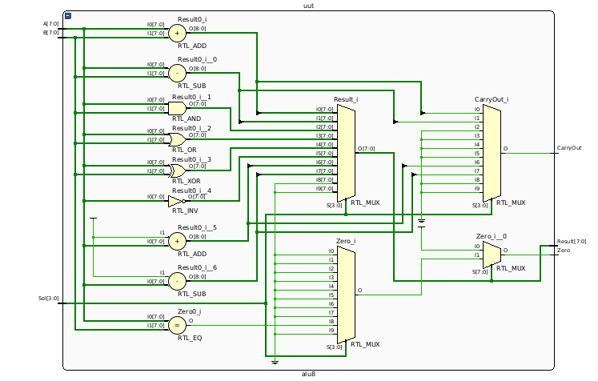

# 8-Bit ALU 

## Overview

This project contains a fully functional 8-bit Arithmetic Logic Unit (ALU) designed for experimentation and simulation in FPGA development environments. The ALU supports multiple operations on 8-bit inputs and provides status outputs for monitoring results.

## Contents

* `alu.v` – The Verilog module representing the 8-bit ALU.
* `alu_tb.v` – Testbench for simulating and verifying the ALU’s behavior.

## Features

* Supports arithmetic and logical operations.
* Generates status signals to indicate results.
* Designed for easy simulation and verification.

## Usage

1. Open the project in Vivado or any Verilog-compatible simulation environment.
2. Add `alu.v` as a source file.
3. Add `alu_tb.v` as a simulation source.
4. Run behavioral simulation to observe the ALU’s operation and output behavior.

## Requirements

* Vivado Design Suite or any standard Verilog simulator.
* Basic knowledge of Verilog and simulation workflows.

## Notes

* The project is intended for learning, testing, and simulation purposes.
* No specific hardware board is required for simulation.

